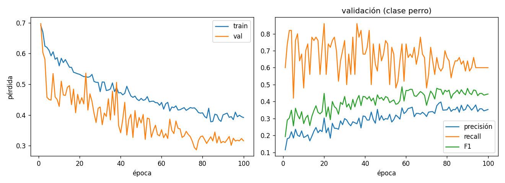

# Implementación de MobileViT

Proyecto práctico orientado al aprendizaje de **Deep Learning** mediante la reproducción e implementación desde cero de la arquitectura **MobileViT**.

El proyecto parte del trabajo:

> S. Mehta and M. Rastegari, *MobileViT: Light-weight, General-purpose, and Mobile-friendly Vision Transformer*, 2021. [Paper en arXiv](https://arxiv.org/abs/2110.02178)

El objetivo principal es comprender el funcionamiento interno de MobileViT, reproducir su bloque fundamental y utilizarlo posteriormente para construir y entrenar un clasificador de imágenes.

## Contenido

El proyecto se desarrolla siguiendo varias etapas:

1. Implementación del **bloque MobileViT**.
2. Construcción de la red de ejemplo basada en la arquitectura presentada en el paper.
3. Preparación de un problema de **clasificación binaria** utilizando STL-10.
4. Entrenamiento y validación del modelo.
5. Evaluación final sobre el conjunto de test.
6. Análisis de las métricas y del comportamiento del entrenamiento.

---

## 1. Implementación del bloque MobileViT

La primera parte del proyecto reproduce paso a paso el bloque **MobileViT** descrito en el paper.

El bloque combina:

* Capas convolucionales para obtener representaciones locales.
* Transformaciones `unfold` para organizar las características espaciales como una secuencia de patches.
* Un Transformer para modelar relaciones globales.
* Transformaciones `fold` para recuperar la estructura espacial.
* Capas convolucionales para realizar la fusión de características.

La implementación se realiza directamente en **PyTorch**, con el objetivo de comprender las transformaciones de tensores que tienen lugar dentro del bloque en lugar de utilizar una implementación ya existente.

---

## 2. Construcción de la red

Una vez implementado el bloque MobileViT, se construye una red completa siguiendo la arquitectura mostrada en la figura de referencia del paper.

La configuración utilizada toma como referencia **MobileViT-S**, utilizando también la configuración proporcionada por los autores en su repositorio oficial:

[Configuración oficial de MobileViT-S](https://github.com/apple/ml-cvnets/blob/main/cvnets/models/classification/config/mobilevit.py)

La red se adapta posteriormente para realizar clasificación binaria.

---

## 3. Clasificación de perros con STL-10

Para poner en práctica la arquitectura se utiliza el conjunto de datos **STL-10**.

STL-10 contiene 10 categorías de imágenes. Para este proyecto se transforma el problema original en una clasificación binaria:

* **Perro** — clase positiva.
* **No perro** — resto de clases.

El conjunto de entrenamiento se divide en:

* **90 %** para entrenamiento.
* **10 %** para validación.

El conjunto de test de STL-10 se mantiene separado y únicamente se utiliza al finalizar el entrenamiento.

### Aumento de datos

Las transformaciones de entrenamiento incluyen aumento de datos aleatorio y se aplican de forma *lazy*, es decir, en el momento en que el `DataLoader` solicita cada muestra.

Durante validación y test no se utilizan transformaciones aleatorias.

### Desbalance de clases

Al convertir STL-10 en un problema binario aparece un fuerte desbalance entre las clases.

En el conjunto de entrenamiento utilizado:

```text
No perro: 4050 imágenes
Perro:     450 imágenes
```

Por este motivo, la función de pérdida utiliza pesos de clase mediante `CrossEntropyLoss`, dando mayor peso a los errores cometidos sobre la clase minoritaria.

---

## 4. Entrenamiento

El entrenamiento implementa un pipeline completo de Deep Learning:

* Forward pass.
* Cálculo de la función de pérdida.
* Backpropagation.
* Actualización de parámetros.
* Validación al final de cada época.
* Registro de métricas.
* Guardado del mejor checkpoint.

Se utiliza **AdamW** como optimizador y un scheduler compuesto por:

1. *Warmup* inicial.
2. Decaimiento del learning rate mediante *Cosine Annealing*.

También se utilizan:

* **Automatic Mixed Precision (AMP)** para reducir el consumo de memoria y acelerar el entrenamiento en GPU.
* **Gradient clipping** para limitar la norma de los gradientes.
* **Weight decay** como mecanismo de regularización.

El mejor modelo se selecciona utilizando el **F1-score sobre el conjunto de validación**, en lugar de utilizar únicamente accuracy debido al desbalance entre las clases.

---

## 5. Validación y evaluación

Durante el entrenamiento se registran las siguientes métricas sobre la clase positiva (*perro*):

* **Precision**
* **Recall** 
* **F1-score**
* **Accuracy**
* **Loss**

También se registra la evolución del learning rate.

El historial permite analizar el comportamiento del modelo durante el entrenamiento y detectar posibles problemas de *overfitting* o *underfitting*.

---

## 6. Resultados

El modelo obtenido consigue realizar la clasificación de perros, aunque su rendimiento es **moderado**.

El mejor checkpoint se obtiene en la época **58**, según el F1-score de validación.

En el conjunto de test se obtuvieron:

| Métrica   | Resultado |
| --------- | --------: |
| Accuracy  |     0.857 |
| Precision |     0.368 |
| Recall    |     0.599 |
| F1-score  |     0.456 |

La matriz de confusión obtenida fue:

```text
              no perro   perro
no perro          6376      824
perro              321      479
```

La diferencia entre accuracy y las métricas específicas de la clase *perro* es especialmente relevante. Debido al desbalance del conjunto de datos, una accuracy relativamente alta puede ocultar un rendimiento mucho más limitado sobre la clase minoritaria.

### Evolución del entrenamiento

El repositorio incluye las gráficas generadas durante el entrenamiento para analizar:

* Evolución de la pérdida de entrenamiento y validación.
* Precision de la clase *perro*.
* Recall de la clase *perro*.
* F1-score de la clase *perro*.

Estas gráficas permiten observar la evolución del modelo a lo largo de las épocas.



> **Resultados:** el modelo debe considerarse principalmente como una implementación experimental y de aprendizaje de MobileViT, no como un clasificador optimizado para STL-10.

### Limitaciones observadas

Una posible causa del rendimiento limitado es la cantidad reducida de ejemplos disponibles para la clase positiva. Tras convertir STL-10 en un problema binario, únicamente se utilizan **450 imágenes de perros para entrenamiento**, frente a 4050 imágenes de la clase *no perro*.

Aunque se utilizan pesos de clase y aumento de datos para mitigar este problema, la cantidad de ejemplos sigue siendo limitada para entrenar una arquitectura de este tipo desde cero.

---

## Estructura del proyecto

El proyecto se presenta principalmente como un **Jupyter Notebook** que documenta progresivamente:

* Implementación del bloque MobileViT.
* Construcción de la red.
* Preparación del dataset STL-10.
* Adaptación a clasificación binaria.
* Entrenamiento del modelo.
* Validación.
* Evaluación y test.
* Resultados.

## Objetivo del proyecto

El objetivo principal no es obtener el mejor clasificador posible, sino utilizar MobileViT como vehículo para estudiar de forma práctica diferentes conceptos de Deep Learning:

* Redes convolucionales.
* Vision Transformers.
* Atención y representación global.
* Manipulación de tensores y patches.
* Entrenamiento mediante backpropagation.
* Optimización con AdamW.
* Learning-rate scheduling.
* Regularización.
* Mixed precision.
* Clasificación desbalanceada.
* Métricas de evaluación.
